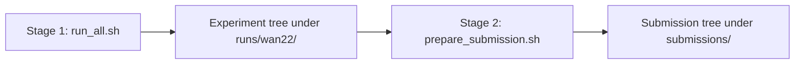

# mlperf-inference-6.1-wan-2.2-t2v-a14b

MLPerf inference v6.1 harness for the [`wan-2.2-t2v-a14b`](https://github.com/mlcommons/inference/tree/master/text_to_video/wan-2.2-t2v-a14b) text-to-video benchmark.

Built on top of `amdsiloai/pytorch-xdit:v26.6`.

## Status

End-to-end MLPerf inference v6.1 harness for wan-2.2-t2v-a14b:

* **Mock backend** — exercises the full LoadGen plumbing (SUT, QSL, runner,
  artefacts) without a GPU, model weights, or `torch.distributed`.
* **Wan 2.2 backend** (`--backend wan22`) — drives the real
  `Wan-AI/Wan2.2-T2V-A14B-Diffusers` model through xfuser/xDiT, launched
  multi-rank via `torchrun`.
* **Multi-rank dispatch** — Offline uses **AsyncDPDispatcher** (pull-style
  scheduling on a Gloo control subgroup; default in
  `configs/wan22/Offline.yaml`) with the legacy wave dispatcher available
  for A/B comparison. SingleStream uses Ulysses sequence-parallel across
  all ranks. Bulk frame/MP4 transfer for data-parallel dispatchers defaults
  to POSIX shared memory (`result_transport: shm`); Gloo tensor transfer
  remains selectable.
* **Scenarios** — Offline and SingleStream, each in performance and accuracy
  mode.
* **Submission helpers** — `scripts/run_all.sh` runs the full experiment
  matrix (LoadGen + TEST04 + VBench); `scripts/prepare_submission.sh`
  packages results, source (`src/`), measurements, and README into an
  MLPerf submission tree.
* **Diagnostics** — `scripts/measure_post_run_overhead.sh` profiles
  per-phase cost after `backend.run_unit` returns (result packaging,
  cross-rank transfer, LoadGen completion) using the mock backend under
  real-sized frames.

## Quick start

All harness work runs inside the Docker image. On the **host**:

```bash
./launch.sh --build    # once, or when docker/Dockerfile changes
./launch.sh            # interactive shell at /workspace/wan-harness
```

The commands below assume you are **inside the container** (working
directory `/workspace/wan-harness`) unless noted. `launch.sh` bind-mounts
the repo and `/hf_cache`, so files written under `data/` or `runs/` persist
on the host.

Optional host-side overrides before `./launch.sh` (see `launch.sh` header for
details): `WAN_HARNESS_HF_CACHE`, `WAN_VBENCH_PRETRAINED`, `WAN_HARNESS_RUNS_DIR`.

For automation, `./launch.sh <cmd>` from the host runs `<cmd>` in a fresh
container (same bind mounts, no interactive shell).

### Mock dry-run (no data download)

The Mock backend falls back to a small synthetic prompt set when
`data/vbench_prompts.txt` is absent, so you can smoke-test the harness
immediately:

```bash
# Offline, performance:
wan-harness run --backend mock --scenario Offline --mode performance

# SingleStream + accuracy artefacts:
wan-harness run --backend mock --scenario SingleStream --mode accuracy
```

### Real Wan 2.2 runs

> **Important:** Before any `--backend wan22` run, download the official
> benchmark inputs. Neither `run_all.sh` nor the harness fetches these for
> you — they must already be on disk under `data/`:
>
> ```bash
> python3 -m tools.fetch_data
> ```
>
> This writes `data/vbench_prompts.txt` (248 VBench prompts, required) and
> `data/fixed_latent.pt` (deterministic initial noise, strongly recommended).
> Both files are gitignored. See [`data/README.md`](data/README.md) for
> optional accuracy-mode inputs and downloader flags.

Single scenario:

```bash
./scripts/run_scenario.sh \
    --backend wan22 --scenario Offline --mode performance
```

See [Submission workflow](#submission-workflow) for the full two-stage process
(experiments, then packaging).

Quick smoke test without the full VBench prompt list (uses
`data/synthetic_prompts.txt` instead):

```bash
./scripts/smoke_wan22.sh Offline
```

### Without Docker

The Mock dry-run also works on a CPU-only host as long as `mlperf_loadgen`
is installed:

```bash
pip install -e .
pip install <path-to-mlcommons/inference>/loadgen
wan-harness run --backend mock --scenario Offline --mode performance
```

For `wan22`, fetch the data first (`python3 -m tools.fetch_data`), then run
inside the container image (or an equivalent ROCm + xDiT environment).

## Submission workflow

Submission is a **two-stage** process: first run the full experiment matrix,
then package the finished run into the directory layout expected by the
upstream MLPerf submission checker. Stage 2 never modifies the experiment
tree from stage 1.



### Stage 1 — Run experiments

Inside the container, after `python3 -m tools.fetch_data`:

```bash
./scripts/run_all.sh --backend wan22
```

This executes, for each of **Offline** and **SingleStream**:

| Step | Output |
| ---- | ------ |
| Performance run | `{Scenario}/performance/run_1/mlperf_log_*` |
| Accuracy run | `{Scenario}/accuracy/mlperf_log_*` plus `artefacts/*.mp4` and a symlink `artefacts/mlperf_log_accuracy.json` → `../mlperf_log_accuracy.json` |
| TEST04 compliance | `{Scenario}/TEST04/` and `{Scenario}/compliance/TEST04/` |
| VBench scoring | `{Scenario}/accuracy/accuracy.txt` and `{Scenario}/accuracy/vbench/` |

The experiment root defaults to a timestamped directory under
`runs/wan22/`, with a `latest` symlink refreshed on each run. A
`MANIFEST.json` at the root records git state, host, and CLI args.

Example layout (abbreviated):

```text
runs/wan22/<timestamp>_g<sha>/
├── MANIFEST.json
├── Offline/
│   ├── performance/run_1/
│   ├── accuracy/{artefacts/, accuracy.txt, vbench/, mlperf_log_*}
│   │   └── artefacts/mlperf_log_accuracy.json → ../mlperf_log_accuracy.json
│   ├── TEST04/
│   └── compliance/TEST04/
└── SingleStream/…
```

Useful flags:

* `--name LABEL` — suffix the experiment directory for easier identification.
* `--skip-compliance` / `--skip-vbench` — skip TEST04 or VBench (not suitable
  for a full submission).
* `--dry-run-plan` — print the resolved command list without running anything.

Wait for the final summary to report all steps **OK** before proceeding.
VBench is skipped automatically for `--backend mock` (no `.mp4` artefacts).

### Stage 2 — Generate the submission tree

Once stage 1 finishes successfully, package the experiment with
`prepare_submission.sh`. This copies LoadGen logs into the checker layout,
truncates `mlperf_log_accuracy.json` to the MLPerf 10 KiB limit, re-emits
`accuracy.txt` with a `hash=` line matching the truncated log, installs the
system description JSON, archives harness source under `src/`, and writes
`measurements.json` plus a per-scenario `README.md`.

**Prerequisite:** inside the container, checkout the harness git commit
recorded in the experiment `MANIFEST.json` before packaging (strict
reproducibility policy — packaging refuses dirty trees and mismatched HEAD).

**1. Verify the system description** (optional but recommended):

```bash
python3 -m tools.verify_system_desc systems/8xMI355X_2xEPYC_9575F.json
```

**2. Dry-run the packaging plan:**

```bash
./scripts/prepare_submission.sh \
    --experiment-root runs/wan22/latest \
    --output submissions/amd \
    --submitter AMD \
    --dry-run
```

**3. Build the submission tree:**

```bash
./scripts/prepare_submission.sh \
    --experiment-root runs/wan22/latest \
    --output submissions/amd \
    --submitter AMD
```

Defaults: `--system 8xMI355X_2xEPYC_9575F`,
`--system-desc systems/8xMI355X_2xEPYC_9575F.json`, `--division closed`,
`--benchmark wan-2.2-t2v-a14b`, `--user-conf configs/user.conf`.

Output layout:

```text
submissions/amd/
├── PREPARE_MANIFEST.json
└── closed/AMD/
    ├── src/wan-2.2-t2v-a14b/              ← git archive @ experiment SHA
    │   ├── REPRODUCIBILITY.json
    │   ├── docker/Dockerfile
    │   ├── launch.sh
    │   └── …
    ├── systems/8xMI355X_2xEPYC_9575F.json
    └── results/8xMI355X_2xEPYC_9575F/wan-2.2-t2v-a14b/
        ├── Offline/
        │   ├── performance/run_1/          ← from experiment performance run
        │   ├── accuracy/                     ← logs + truncated accuracy json
        │   │   ├── mlperf_log_*.txt/json
        │   │   ├── accuracy.txt              ← hash matches truncated json
        │   │   └── videos/                   ← 10 audit .mp4 + captions.txt
        │   ├── TEST04/performance/run_1/
        │   ├── TEST04/verify_performance.txt
        │   ├── measurements.json
        │   ├── README.md
        │   └── user.conf
        └── SingleStream/…
```

Notes:

* **Full accuracy video set is not copied.** The 248 `.mp4` files under
  `artefacts/` stay in the experiment tree. Stage 2 copies only the
  10 audit samples required by the submission checker into
  `accuracy/videos/` (plus `captions.txt`), along with LoadGen logs and
  `accuracy.txt`.
* **The experiment tree is read-only.** Truncation and hash refresh happen
  on copies under `submissions/`, so the full `mlperf_log_accuracy.json`
  remains available locally.
* **`--skip-compliance`** — omit TEST04 directories when stage 1 was run
  with `--skip-compliance`.
* **`--skip-vbench-refresh`** — copy `accuracy.txt` as-is (diagnostics only;
  hash will not match a truncated log).
* **`--skip-code`** — omit the `src/wan-2.2-t2v-a14b/` source snapshot.
* **`--skip-measurements`** / **`--skip-readme`** — omit those checker files.

**4. Run the upstream submission checker** (inside the container):

```bash
./scripts/verify_submission.sh \
    --input submissions/amd \
    --submitter AMD
```

This invokes the upstream modular checker
`tools/submission/submission_checker/main.py`. It passes
`--skip-extra-files-in-root-check` because Stage 2 writes
`PREPARE_MANIFEST.json` at the submission root.

Extra checker flags (e.g. `--skip-calibration-check`) can be passed after
`--`:

```bash
./scripts/verify_submission.sh --input submissions/amd --submitter AMD -- \
    --skip-calibration-check
```

Merge the generated tree into your org's `inference_results` checkout, add
an org-level `closed/<org>/README.md` if needed. Power artefacts (if
applicable) remain manual.

## Layout

```text
src/wan_harness/           # Python package
  cli.py                   # argparse entrypoint (the `wan-harness` console script)
  config.py                # HarnessConfig: YAML + CLI + env merge
  loadgen_runner.py        # TestSettings construction + StartTestWithLogSettings
  qsl.py                   # QSL with real load/unload semantics
  sut.py                   # SUT: bridges LoadGen <-> backend; streams completions
  dispatcher.py            # AsyncDP / Wave / Ulysses dispatchers (multi-rank wan22)
  shm_pool.py              # POSIX SHM slots for bulk Result transfer (DP default)
  wire.py                  # rank-0 <-> worker IPC + Result transport (SHM or Gloo)
  post_run_overhead.py     # per-phase timings after backend.run_unit returns
  logging_utils.py         # shared logging setup for CLI and tools
  response.py              # bytes -> QuerySampleResponse, with array-lifetime guard
  artefacts.py             # per-sample sidecar writer for accuracy mode
  video_encoder.py         # ffmpeg/libx264 MP4 encoding for accuracy artefacts
  vbench.py                # standalone VBench evaluator (accuracy.txt + summary)
  data/prompts.py          # prompt loading + synthetic fallback for mock dry-runs
  backends/
    base.py                # Backend Protocol + GeneratedVideo dataclass
    mock.py                # MockBackend (no torch, no GPU, no dist)
    wan22.py               # Wan 2.2 backend (xfuser MODEL_REGISTRY)
    wan22_config.py        # per-scenario YAML schema (Offline / SingleStream)
configs/
  inference_config.yaml    # generation params (mirrored from upstream)
  user.conf                # LoadGen tunables
  compliance/TEST04-audit.config   # Wan-specific TEST04 audit keys (min_query_count=64)
  wan22/                   # per-scenario backend config (dispatch, result_transport, xfuser)
docker/
  Dockerfile               # FROM amdsiloai/pytorch-xdit:v26.6
  requirements.txt         # intentionally empty
  entrypoint.sh
launch.sh                  # docker build + run wrapper (bind-mounts repo + /hf_cache)
scripts/
  run_scenario.sh          # single (scenario, mode) invocation
  run_all.sh               # stage 1: full experiment matrix
  run_vbench.sh            # score one accuracy run with VBench
  verify_compliance.sh     # TEST04 audit run + verification
  prepare_submission.sh    # stage 2: package experiment → submission tree
  measure_post_run_overhead.sh   # mock multi-rank post-run_unit profiling
  smoke_wan22.sh           # fast wan22 smoke test with synthetic prompts
systems/
  8xMI355X_2xEPYC_9575F.json   # system description for submission
tools/
  fetch_data.py            # download vbench_prompts.txt + fixed_latent.pt
  plot_sample_runtimes.py  # histogram per-sample inference times from run.log
  compare_sample_runtimes.py  # A/B scatter + delta plot for two performance runs
  run_vbench.py            # VBench scoring + accuracy.txt for a finished run
  prepare_submission.py    # submission tree builder (called by the script)
  verify_system_desc.py    # compare system JSON against the current host
tests/                     # pytest; distributed dispatcher + SHM transport tests need torchrun
data/                      # runtime inputs (gitignored; see data/README.md)
```

## Multi-rank architecture

Wan 2.2 runs are always launched under `torchrun`. Rank 0 owns LoadGen;
other ranks sit in a dispatcher worker loop until shutdown.

| Scenario | Dispatcher | Config (`configs/wan22/`) |
| -------- | ---------- | ------------------------- |
| Offline | AsyncDPDispatcher (default) or WaveDispatcher | `parallelism.dispatch` (`async` or `wave`), `data_parallel_workers: 8` |
| SingleStream | UlyssesDispatcher | `parallelism.mode: ulysses`, `ulysses_degree: 8` |

For Offline data-parallel dispatchers, bulk frame/MP4 bytes move through
POSIX shared-memory slots by default (`parallelism.result_transport: shm` in
`Offline.yaml`). Gloo carries control messages and slot handoff; the legacy
Gloo tensor path remains available via `result_transport: gloo` or
`wan-harness run --result-transport gloo`.

### Post-run overhead profiling

Model time dominates end-to-end latency, but Offline throughput also depends
on packaging frames into wire `Result`s, moving them across ranks, and
completing LoadGen responses. Enable the built-in collector with
`--measure-post-run-overhead` or use the convenience wrapper:

```bash
# Default: async DP + SHM, 8 mock ranks, real frame dimensions:
./scripts/measure_post_run_overhead.sh

# Compare wave dispatch or legacy Gloo transport:
./scripts/measure_post_run_overhead.sh --dispatch wave
./scripts/measure_post_run_overhead.sh --result-transport gloo
```

Each rank writes `post_run_overhead_rank<N>.json` under the output directory;
rank 0 also logs an aggregate summary at INFO level.

## Per-sample runtime plots

After a performance run, ``tools/plot_sample_runtimes`` reads each scenario's
``run.log``, extracts per-sample **inference** wall times (warmup omitted),
prints summary stats (including fastest/slowest sample and prompt), and writes a
histogram PNG under ``run_1/``. Requires ``matplotlib`` (``pip install
matplotlib`` in the container).

```bash
# Latest experiment under runs/wan22/latest (one scenario per invocation):
python3 -m tools.plot_sample_runtimes --scenario SingleStream
python3 -m tools.plot_sample_runtimes --scenario Offline

# Or point at a specific run directory (scenario auto-detected):
python3 -m tools.plot_sample_runtimes \
    --run-dir runs/wan22/latest/Offline/performance/run_1
```

Outputs: ``singlestream_sample_runtimes.png`` and ``offline_sample_runtimes.png``
in the respective ``run_1/`` directories. ``sample_index`` maps to line
``sample_index`` in ``vbench_prompts.txt`` (0-based).

## VBench evaluation

`run_all.sh` invokes VBench automatically after each successful accuracy run
(via `scripts/run_vbench.sh`). You can also score a single run manually. The
tool reads the videos and prompt map the harness wrote (`artefacts/*.mp4` plus
`artefacts/prompts.json`; accuracy mode also symlinks
`artefacts/mlperf_log_accuracy.json` to the parent log so downstream tools
can treat `artefacts/` as a single consumable directory), stages them under
`vbench/videos_staged/` as
`{prompt}-{index}.mp4` symlinks (the layout VBench's vbench_standard mode
parses with `vbench.utils.get_prompt_from_filename`), launches the upstream
VBench evaluator under `torch.distributed.run`, and emits the MLPerf
submission artefact `accuracy.txt` alongside a structured
`vbench/vbench_summary.json` sidecar.

```bash
# Inside the container (with-vbench activates the isolated VBench venv):
with-vbench python -m tools.run_vbench \
    runs/wan22/latest/Offline/accuracy

# Equivalent via the harness CLI:
with-vbench wan-harness vbench \
    runs/wan22/latest/Offline/accuracy

# Without Docker / host venv: pass --no-with-vbench so the current
# python drives torch.distributed.run directly.
python3 -m tools.run_vbench --no-with-vbench \
    runs/wan22/latest/Offline/accuracy
```

Each invocation produces three groups of output under the run directory:

| Path                              | Purpose                                                                                                                                |
| --------------------------------- | -------------------------------------------------------------------------------------------------------------------------------------- |
| `accuracy.txt`                    | **MLPerf submission artefact.** Per-dim scores + `'vbench_score': XX.XXXX` + `hash=<sha256>`. Parsed by `submission_checker`.          |
| `vbench/vbench_summary.json`      | Structured sidecar for tooling/CI (per-dim n, paths, sha256, timestamps).                                                              |
| `vbench/results_*_eval_results.json` plus `vbench/stdout.log` / `stderr.log` | Raw VBench output. Re-parse with `--parse-only` to re-emit `accuracy.txt` without re-running VBench.                 |

### Submission contract for `accuracy.txt`

The file is parsed by the upstream submission checker
(`mlcommons/inference/tools/submission/submission_checker/`). Two regexes
must match:

* `r".*'vbench_score':\s([\d.]+).*"` — score on the 0–100 scale, target
  `>= 70.48 * 0.99 = 69.7752` per [`inference_rules.adoc`](https://github.com/mlcommons/inference_policies/blob/master/inference_rules.adoc).
* `r"^hash=([\w\d]+)$"` — sha256 of `mlperf_log_accuracy.json` in its
  on-disk state, byte-equivalent to `tools/submission/truncate_accuracy_log.py:get_hash()`.

The submitter workflow for the **experiment tree** (stage 1) is:

1. Run the harness in accuracy mode (produces a `mlperf_log_accuracy.json` that
   may be many GB).
2. Run VBench scoring (`run_all.sh` does this automatically).

**Stage 2** (`prepare_submission.sh`) then, on copies in the submission tree:

1. Truncates `Accuracy/mlperf_log_accuracy.json` to fit under
   `MAX_ACCURACY_LOG_SIZE = 10 KiB` (same algorithm as upstream
   `truncate_accuracy_log.py`).
2. Re-emits `Accuracy/accuracy.txt` from the existing VBench results so the
   `hash=` line matches the truncated file that ships in the submission.

If you run VBench manually before packaging and skip truncation, the tool warns
(non-fatal) when the accuracy log is still oversized; the hash in
`accuracy.txt` will not pass the checker until stage 2 refreshes it.

### Operational notes

* **VBench is single-rank by default.** `--nproc-per-node` defaults to
  `1`. The wall-clock cost is small (~4 min on a single MI355X for the
  248-prompt MLPerf set), and it sidesteps two real failure modes we
  hit at 8 ranks: the upstream `dynamic_degree` distributed bug
  ([Vchitect/VBench#141](https://github.com/Vchitect/VBench/pull/141))
  and a one-time DINO checkpoint-download race in the per-dimension
  preludes. Override with `--nproc-per-node N` if your checkpoint cache
  is warm and the VBench venv's ROCm runtime matches the host's.
* **Checkpoint cache.** VBench downloads several GB of per-dimension
  checkpoints (AMT, RAFT, DINO, tag2text, CLIP, ...) on first run. The
  image sets `VBENCH_CACHE_DIR=/hf_cache/vbench` so all of those land
  inside the `/hf_cache` bind-mount, alongside the Hugging Face cache,
  and the download is paid once per host, not once per container. Set
  `WAN_VBENCH_PRETRAINED=<host dir>` on the host before `./launch.sh`
  only if you need the VBench checkpoints on a different filesystem
  from the rest of `${HF_CACHE}`; otherwise leave it unset.
